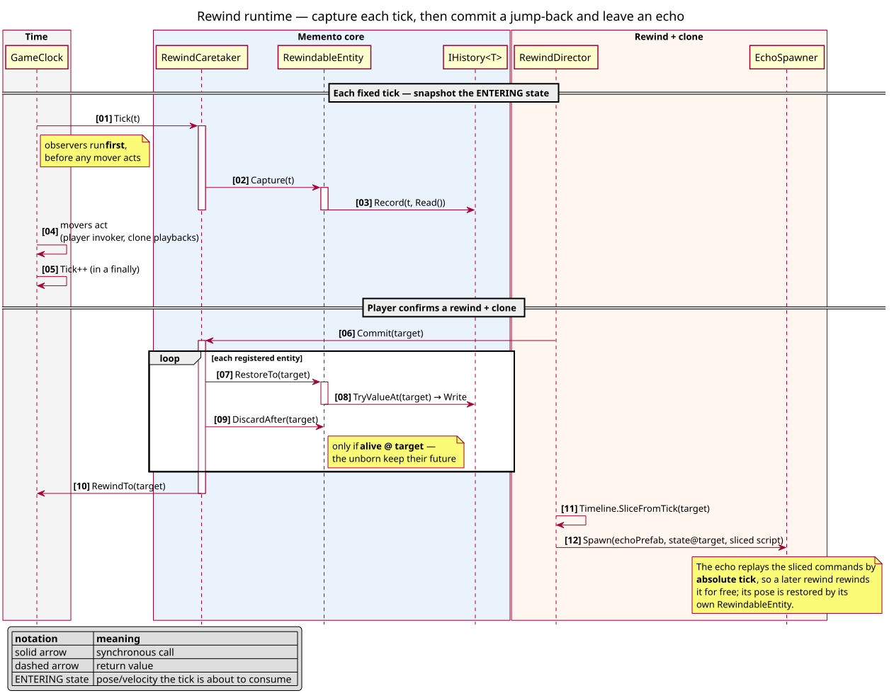
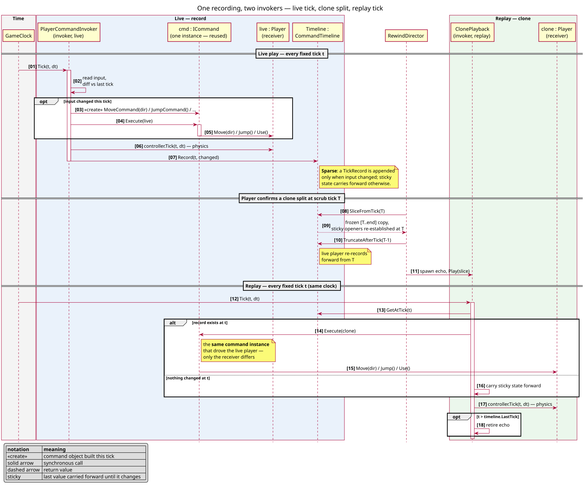
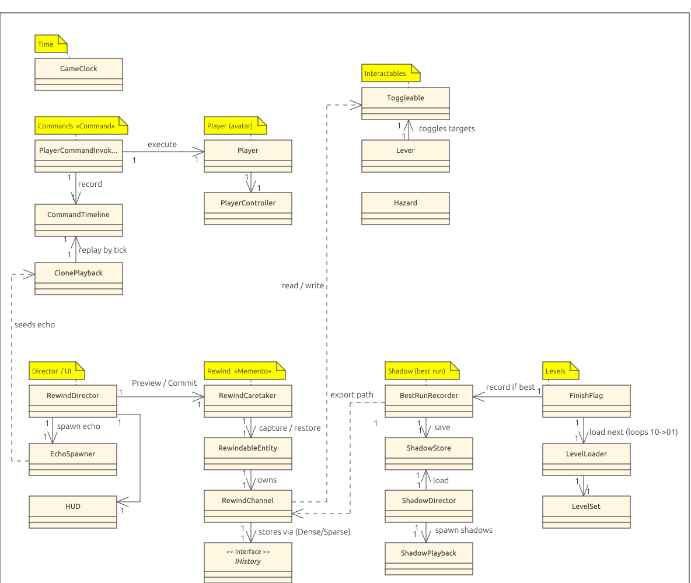
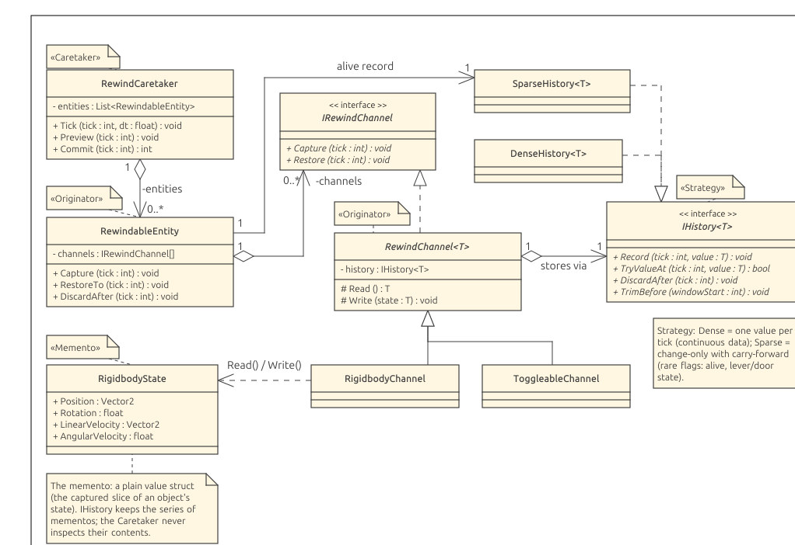

# Rapport d'implémentation - Pattern Commande

**MCR 2025-2026**

## 1. Contexte et présentation du projet

Notre jeu propose de traverser des niveaux comme dans un Plateformer classique, avec un twist ; le joueur peut remonter dans le temps à volonté, laissant derrière lui un écho qui tente d'imiter ses actions. Le joueur doit donc composer avec plusieurs timelines pour résoudre de petites énigmes, et le chaos d'une multitude de clones se marchant dessus...

Les niveaux défilent en boucle, le joueur entrant en compétition avec l'ombre de sa meilleure performance enregistrée dès qu'il revisite un niveau. Il peut optimiser le temps réel de traversée, mais aussi le temps subjectif de ses clones.

Le pattern Commande est particulièrement utile pour enregistrer les actions du joueur 
 et les rejouer sur ses clones. 

- Captures d'écran / aperçu

## 2. Mise en oeuvre du modèle dans l'application

> _Coeur du rapport : comment Command est concrètement implémenté dans le projet et
> pourquoi il est ici pertinent (enregistrement des entrées, rewind, rejeu sur les clones)._

- Correspondance participants du pattern <-> classes du projet
  - `ICommand`, `JumpCommand`, `MoveCommand`, `UseCommand` - les commandes
  - `PlayerCommandInvoker` - l'invocateur
  - `CommandTimeline` / `TickRecord` - l'historique des commandes
  - `ClonePlayback` - le rejeu des commandes par les clones
  - `Player` / `PlayerController` - le receiver
- Cycle d'une commande (capture -> exécution -> enregistrement -> rejeu)
- Choix de conception et alternatives écartées

### 2.1 Détails d'implémentations

Premièrement, le temps et le passage du temps est implémenté par deux classes custom, afin que nous puissions parfaitement le contrôler.

| File | Role |
|------|------|
| `Assets/Scripts/Time/GameClock.cs` | Source de vérité pour le temps ; un tick par `FixedUpdate` (tick de simulation physique, delta entre les ticks constant). |
| `Assets/Scripts/Time/ITickable.cs` | Tout ce qui doit prendre le temps en compte |

#### Rewind

Le rembobinage est implémenté comme un pattern **Memento généralisé**. Le `RewindCaretaker` joue le rôle de *caretaker* ; chaque objet rembobinable est un *originator* dont l'état est découpé en *channels*, et chaque valeur capturée est un *memento*.

| Fichier | Rôle |
|------|------|
| `Assets/Scripts/Rewind/RewindCaretaker.cs` | Détient le registre des entités rewindable et la fréquence de capture ; exécute `Preview`/`Commit`. Observe l'horloge (tické en premier, avant les *movers*). |
| `Assets/Scripts/Rewind/RewindableEntity.cs` | Un objet rewindable : ses `channels` et s'il existe ou non (alive record). |
| `Assets/Scripts/Rewind/Channels/RewindChannel.cs` (+ `IRewindChannel`) | Une propriété rewindable d'un objet ; détient son historique, délègue Read/Write. |
| `…/Channels/RigidbodyChannel.cs` | Position + rotation + les vélocités linéaire et angulaire d'un corps physique. |
| `…/Channels/ToggleableChannel.cs` | État on/off d'un interactable. |
| `…/History/IHistory.cs`, `DenseHistory.cs`, `SparseHistory.cs` | Les deux stratégies de stockage. |

**Memento + Strategy.** Un channel est à la fois l'*originator* et le *memento* ; la logique de stockage est isolée derrière `IHistory<T>` (pattern *Strategy*), donc un channel n'a qu'à choisir sa stratégie parmi deux options :

- **`DenseHistory`** — une valeur par tick : `baseTick + i*step` (O(1), aucun tick stocké par entrée). Typiquement utilisé pour les données continues comme le Rigidbody, car ses valeurs changent de toutes façons à chaque tick, même si infimement.
- **`SparseHistory`** — au changement seulement, avec *carry-forward* et recherche dichotomique. Utilisé pour stocker l'existence d'un objet, l'état des leviers/portes. *Sparse* pour optimiser l'espace pris par l'historique.

Trois choix de conception structurent l'implémentation :

- **Capturer l'état *entrant*** : les observers prennent leur snapshot avant que les movers agissent : ils enregistrent la position/vélocité que le tick s'apprête à consommer. Restaurer puis re-jouer un tick le reproduit donc exactement (capturer après stockerait une vélocité déjà avancée par la gravité, qu'un rewind ferait avancer une seconde fois).
- **Destruction différée + « alive record »** : un objet despawné est désactivé et conservé, et son existence est un `SparseHistory<bool>`. Rewind avant sa mort le réactive ; il n'est réellement `Destroy` que lorsqu'il est dormant et que son dernier changement d'existence est sorti de la fenêtre de rewind (il ne pourra plus jamais être une cible).
- **Discard asymétrique au commit** — `Commit(tick)` restaure tout le monde au tick cible, mais n'efface que l'historique des entités vivantes à l'instant t ciblé (`DiscardAfter`). Une entité pas encore née conserve son futur. Sinon, un clone rewind avant son propre spawn serait effacé et ne pourrait pas renaître quand l'horloge rejoue vers l'avant.

Diagramme de séquence d'un rewind : 

#### Commande

Chaque action du joueur devient un objet Commande, enregistré dans une timeline puis rejoué sur ses clones.

| Fichier | Rôle |
|------|------|
| `Assets/Scripts/Commands/ICommand.cs` | Interface exposant `Execute(Player)` + le marqueur `IStickyCommand`. |
| `MoveCommand` / `JumpHeldCommand` / `JumpCommand` / `UseCommand` | Les actions concrètes. |
| `Assets/Scripts/Commands/PlayerCommandInvoker.cs` | Transforme l'input en commandes à chaque tick, les exécute sur le joueur principal et les enregistre dans une timeline. |
| `Assets/Scripts/Commands/CommandTimeline.cs` (+ `TickRecord`) | L'enregistrement. |
| `Assets/Scripts/Commands/ClonePlayback.cs` | Rejoue une `CommandTimeline` sur un écho. |

**Cycle d'une commande.** À chaque tick : l'invocateur lit les inputs du joueur et les compare au tick précédent (capture) ; s'ils ont changé, l'invocateur crée la ou les commandes adaptées et les exécute sur le joueur actuel ; il enregistre ensuite les commandes dans sa `CommandTimeline`. Lors du rewind, la timeline est donnée à un `ClonePlayback` qui demande si une ou plusieurs actions ont été émises au tick actuel avec `GetAtTick(t)` et ré-exécute ces mêmes commandes sur le clone. Comme l'on utilise des ticks absolus, un rewind de l'horloge rembobine l'émission des actions gratuitement.

Deux choix de conception portent le pattern :

- **Le récepteur est passé à `Execute`, pas stocké.** La **même instance** de commande enregistrée pilote le joueur **live** pendant le jeu, puis un **clone** pendant le rejeu — même commande, cible différente. Ce reciblage est tout le truc des clones.
- **Enregistrement *sparse* : sticky vs discret.** Les états continus (`Move`, `JumpHeld`) sont représentés par des `IStickyCommand`, enregistrés uniquement quand l'état change. Les actions ponctuelles (`Jump`, `Use`) ne sont enregistrées qu'au tick où elles sont activées. La plupart des ticks ne stockent donc rien. Lors d'un rewind, `CommandTimeline.SliceFromTick` ré-établit la dernière commande sticky de chaque type avant le début de l'instant t ciblé, pour que le clone restaure correctement l'état des inputs.

**Divergences/améliorations du pattern Command** :
- **Récepteur non lié à la commande.** Dans le GoF, une commande encapsule son récepteur, fixé à la construction. Ici il est passé à `Execute(receiver)` : la même instance peut donc piloter le joueur principal, puis n'importe quel clone.
- **Pas d'`Undo()` sur la commande.** L'annulation n'est pas portée par les commandes (aucune méthode inverse) ; c'est le pattern Memento qui restaure l'état. Les commandes ne font qu'avancer.
- **Deux invocateurs, un seul enregistrement.** `PlayerCommandInvoker` (live) et `ClonePlayback` (replay) partagent la même `CommandTimeline`. L'invocateur du GoF ne fait que déclencher des commandes ; le nôtre les enregistre aussi.
- **Un historique structuré, pas une file.** Les commandes sont indexées par tick absolu (avec sticky / carry-forward) plutôt qu'empilées dans une simple file, ce qui autorise le découpage (`SliceFromTick`) et l'adressage par le temps.

#### Clones / échos

`RewindDirector` orchestre le scrub : au *commit*, il rewind, découpe la timeline (`SliceFromTick`) et demande l'écho à `EchoSpawner` ; `ClonePlayback` rejoue ensuite la tranche par tick absolu. La pose de l'écho est restaurée par son propre `RigidbodyChannel`, mais vers l'avant la physique n'est pas déterministe, donc les échos divergent légèrement. Lorsqu'ils dépassent la fin de leur timeline, ils sont `Despawn` (désactivé + conservé), donc revenir dans leur fenêtre `[spawn, fin]` les ressuscite.

#### Mouvement & physique du joueur

`PlayerController` est le *receiver* concret du mouvement : c'est lui que `Player` appelle quand une commande s'exécute. Il s'appuie sur une gravité maison (`gravityScale = 0`, tout est calculé dans le code) pour garder un saut bien réglable, et pose directement la vélocité du corps à chaque tick — le moteur physique ne fait plus que résoudre les collisions. Les fenêtres de tolérance du saut, comme le buffer d'entrée et le *coyote time*, sont enregistrées en ticks absolus : dès qu'on rembobine d'un tick, elles redeviennent caduques, ce qui évite les sauts fantômes après un retour en arrière. Enfin, le déplacement se calcule relativement à la vélocité de la surface sur laquelle on se tient (`baseVelocity`), si bien que le joueur comme ses échos se laissent porter naturellement par les plateformes mobiles et même par les autres clones.

## 3. Diagramme de classes

### 3.1 Aperçu global

### 3.2 Diagramme d'implémentation du pattern Command

### 3.3 Diagramme d'implémentation du pattern Memento

## 4. Déploiement

### 4.1 Jouer à une version précompilée

Le moyen le plus simple d'essayer le jeu est de télécharger une version précompilée. Des binaires pour Windows et Linux (x86-64) sont disponibles dans la section [releases](https://github.com/Xenogix/PlatformerMCR/releases) du dépôt. Il suffit de télécharger l'archive correspondant à votre plateforme, de l'extraire, puis de lancer l'exécutable.

### 4.2 Ouvrir le projet pour le développement

Pour développer ou compiler le projet vous-même :

1. **Cloner le dépôt** sur votre machine.
2. **Installer [Unity Hub](https://docs.unity.com/en-us/hub/install-hub)**, qui gère les versions de l'éditeur Unity.
3. **Ouvrir le dossier racine du projet** depuis Unity Hub. Celui-ci détectera la version de Unity requise et vous proposera de l'installer automatiquement. Ce projet utilise **Unity 6**, version `6000.4.6f1`.

### 4.3 Compiler le projet

Une fois le projet ouvert dans l'éditeur Unity :

1. Allez dans `File` -> `Build and Run`.
2. Sélectionnez la plateforme cible (les plateformes disponibles dépendent des modules installés avec Unity).
3. Choisissez le dossier de destination de la compilation. Nous recommandons un dossier `Builds/` à la racine du projet. Ce dossier est déjà ignoré par git.

## 5. Utilisation

> _Comment jouer / utiliser l'application._

- Contrôles
- Déroulement d'un niveau (jouer, rembobiner, rejouer avec le clone)

## 6. Conclusion

> _Bilan : apports du pattern, limites rencontrées, pistes d'amélioration._

## Annexes

- Membres du groupe et répartition du travail
- Références